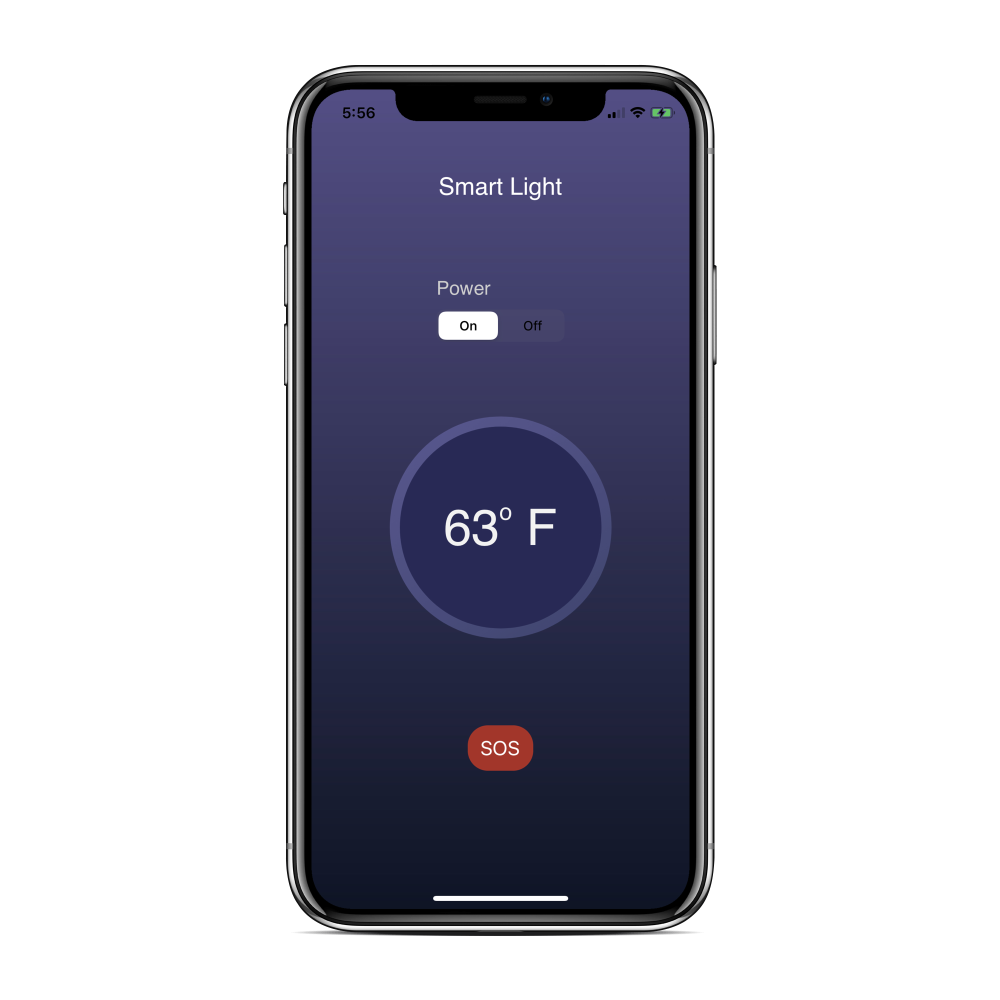

# Home Automation App

This IOS application focuses on controlling BLE device. 
Once connected to the Smart bulb it allows user to control various characteritics.
> 
* Bulb On/Off : Clicking on Pow er On/Off will switch on and off the bulb respectively.
* Temperature : Updated Temprature will always be displayed on the screen.
* Beep characteristic : Clicking on SOS will turn on the beep sound of the smart bulb.
>
